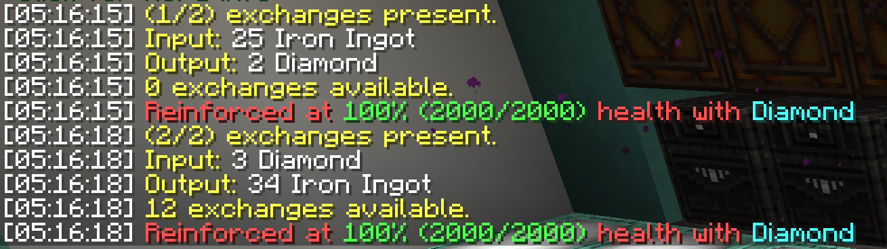
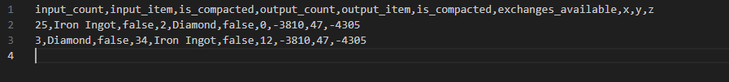

# IEC-Logger
JsMacros script service that logs iec exchange trade information to a csv file!
For help downloading and setting up JsMacros check out a [guide repo I made](https://github.com/VastInfiniteNet/JsMacros-for-CivMc-and-profit).

## Info logged
* input/output item count
* input/output item name
* whether input/output is compacted
* exchanges left for the trade
* exchange location if cti was enabled while service running

# Usage
The script it has pretty detailed comments on how to use it, JsMacros service setup, and minor configuration details, but I will include those here as well.

## Service Setup
1. open JSMacros ui.
2. Go to `Services` tab in bottom lefthand corner.
3. Click `+` top right to add another entry, and name service (i.e. "IEC logger")
4. Click middle File field, navigate to location of this file and select it.
5. Enable and start running the service, you should see a message saying the service has started.

## How to use
Punch any iec chest while service is running. Check the output file to see the exchange trade csv (comma separated value) appended to the output file.
New exchange log entries are appended to the end of the log file. 
Need to run /cti to enable location logging while service is running.

## Configuration 
To change the output logfile location change the below `TRADE_OUTPUT_FILE` variable value.
